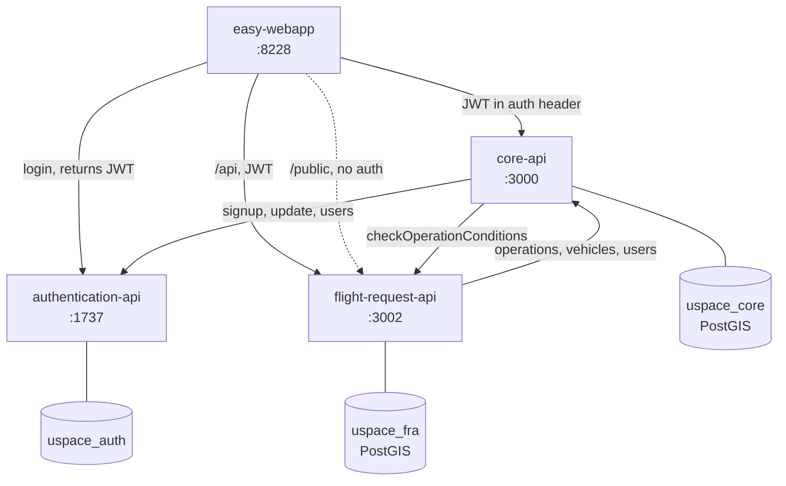

--legacy-peer-deps

# Tenant configuration

tenant

# Environment configuration

ALWAYS import env.ts

src/vendor/environment

env.prod.ts
env.ts
env.prod.ts.sample
env.ts.sample
tenant.ts.sample

ALWAYS use Tenant type for tenant to have compile time errors of missing tenant configurations

# Commit etiquette

npm run commit helps interactive commit title

# System architecture

This repo is the UTM's **only frontend**, but the backend is split across several repos,
and a single feature usually spans more than one. For example, the geographical zones on
the public map are handled half here (client, hook and sidebar) and half in
`flight-request-api-balburdia` (the `/public` endpoints).

| Repo | Branch | Port | Role |
|---|---|---|---|
| [u-space/easy-webapp](https://github.com/u-space/easy-webapp) | `develop` | 8228 | **This repo.** React + Svelte (nx/webpack). Knows all three backends. |
| [u-space/authentication-api](https://github.com/u-space/authentication-api) | `master` | 1737 | Login and JWT issuing (RS256, signs with `private.key`). |
| [u-space/core-api](https://github.com/u-space/core-api) | `main` | 3000 | Operations, vehicles, users, RFV, UVR. TypeORM + PostgreSQL/PostGIS. |
| [smaciasDronfiesLabs/flight-request-api-balburdia](https://github.com/smaciasDronfiesLabs/flight-request-api-balburdia) | `master` | 3002 | Flight requests, geographical zones, coordinators. Prisma + PostgreSQL/PostGIS. |

> ⚠️ [u-space/easy-flightrequestapi](https://github.com/u-space/easy-flightrequestapi)
> is the **old** flight-request-api: it is shut down and does not have the geographical
> zone altitudes (`min_altitude`/`max_altitude`). The one running in production is
> `flight-request-api-balburdia`.

Each backend owns its database and **they share no tables**: whatever one service needs
from another is requested over HTTP, forwarding the user's JWT in the `auth` header.



The endpoints the frontend consumes are configured in `src/vendor/environment/env.ts`
(gitignored; see `env.ts.sample`):

```ts
core_api: 'https://localhost:3000',
flight_request_api: 'https://localhost:3002/api',           // private, sends the token
flight_request_public_api: 'https://localhost:3002/public',  // no auth
```

**Public vs. private map.** The `/map` route mounts `LivePublicMap` **only** when there is
no session (see `src/app/NotLoggedInScreens.tsx`); once logged in, the private map is used
instead. Both share the sidebar's `Menu.tsx`, which picks what to render based on which
hook resolved: the `usePublic*` hooks call the public client (no token) and the others
call the private one. Because of that, adding an entity to the public map's sidebar
requires its own public hook — the private one returns 401 without a session.

# Production deploy (DINACIA)

The frontend is **built** and served as static files. On the production server
(`root@179.27.99.25`) the source lives in `/root/dinacia/easy-webapp` (branch `develop`)
and the bundle served by the web server is in `/var/www/html/dinacia`.

Deploy steps:

1. `cd /root/dinacia/easy-webapp && git pull` (branch `develop`)
2. `npm install --legacy-peer-deps` (only if dependencies changed)
3. `npm run build`  → produces the bundle in `dist/`
4. **Back up** the current bundle before replacing it:
   `tar czf /root/dinacia/easy-webapp.$(date +%F).tar.gz -C /var/www/html dinacia`
5. Copy the new build to `/var/www/html/dinacia`
   (confirm the exact copy command/script with the team; the repo ships `copy-tenants.js`).

Notes:
- The production environment config (`env.prod.ts`) lives on the server and is **not**
  versioned; it is not overwritten by the development `env.ts` (gitignored).
- The backends have no build step (see each API's README); only the frontend is built.
